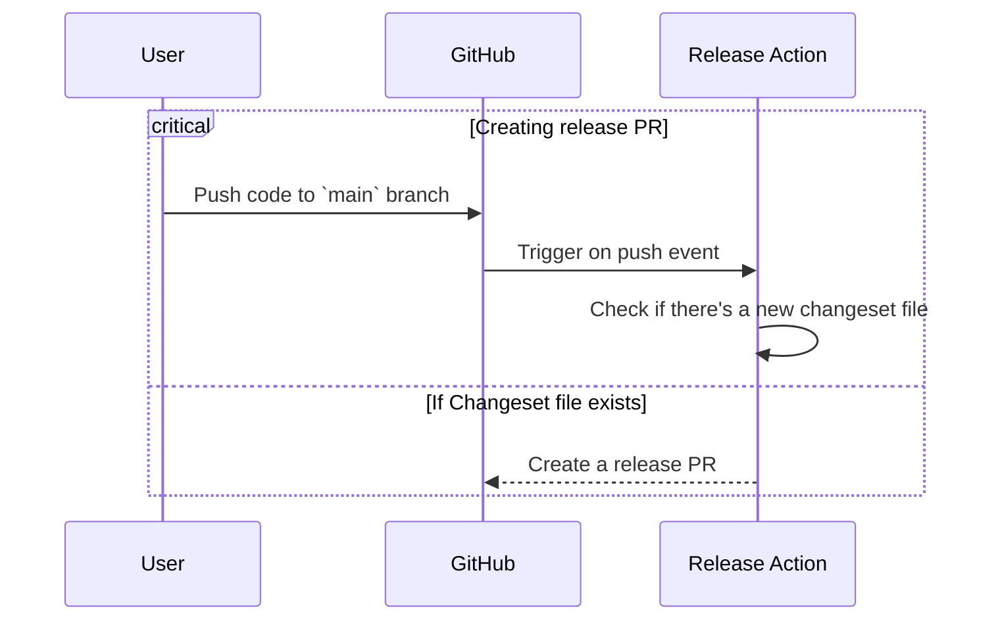
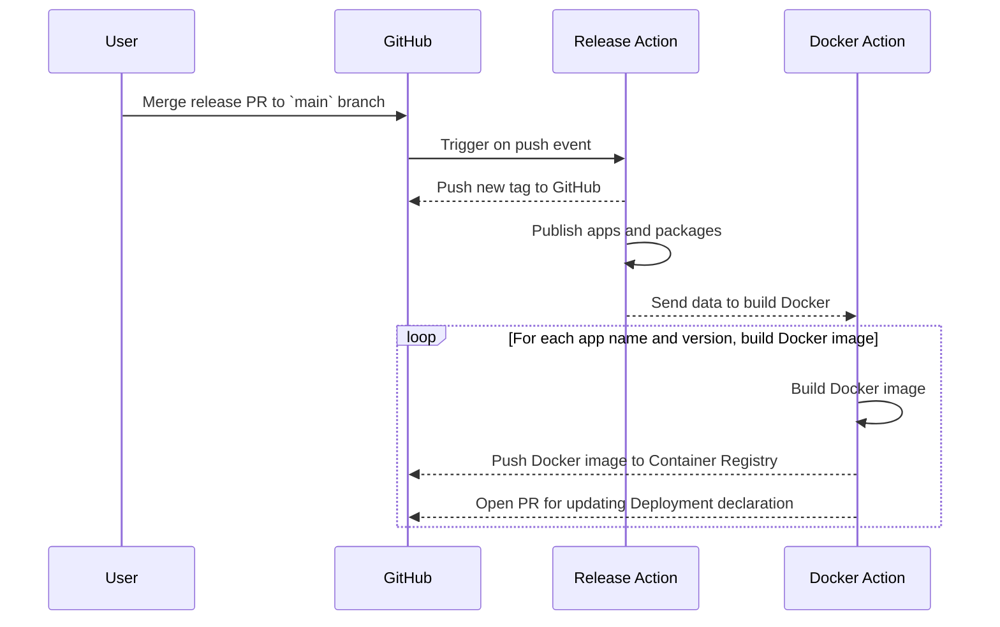
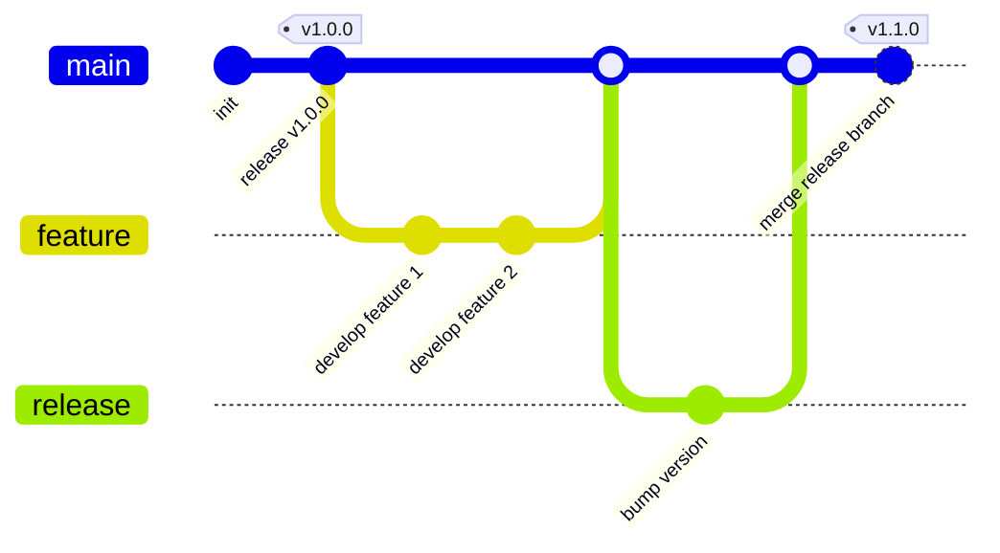
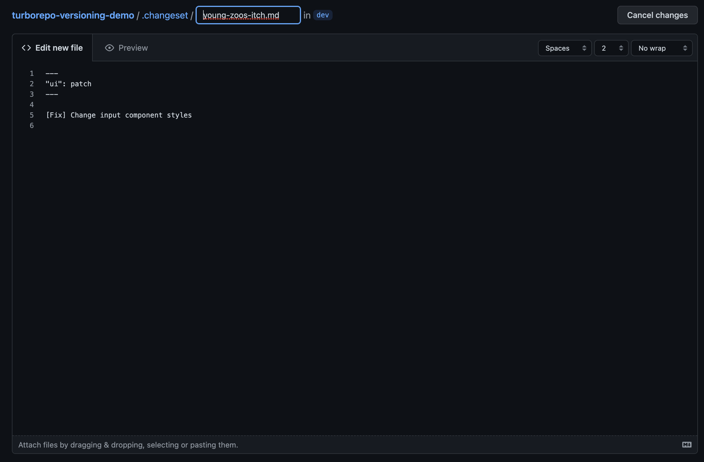
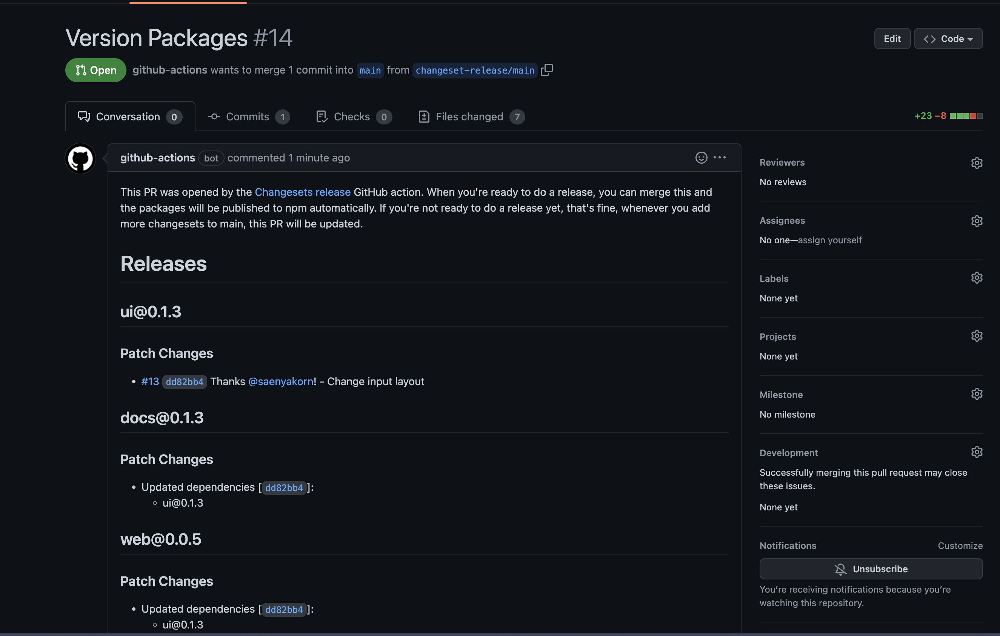
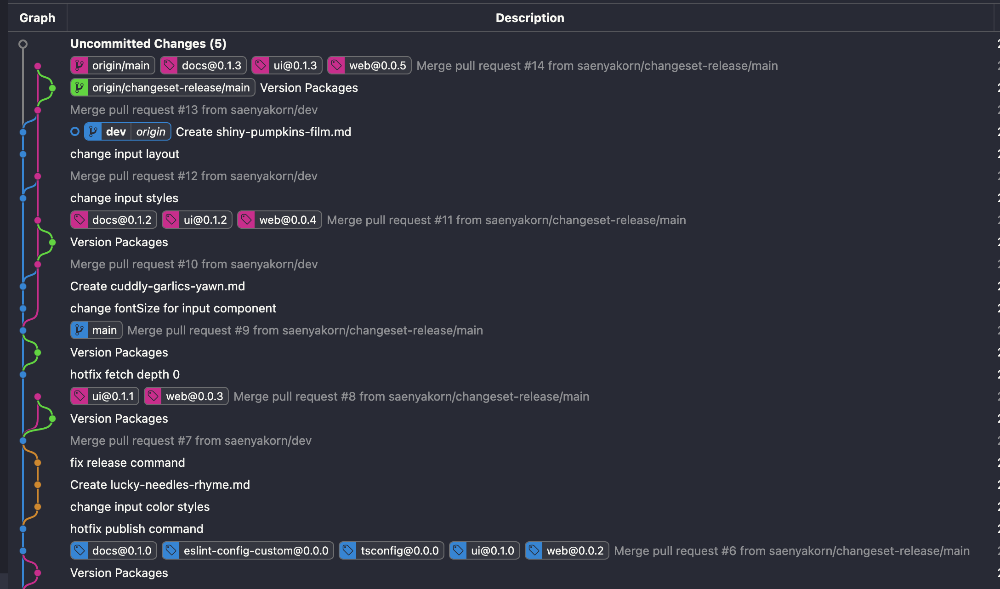
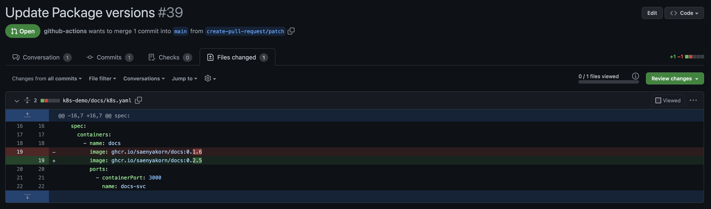

# Turborepo versioning with Changesets <!-- omit in toc -->

As you know, [Turborepo](https://turbo.build/) is a monorepo tool that helps you manage your apps and packages in a monorepo. It's a great tool, but it doesn't have a built-in versioning strategy. So, I decided to use [Changeset](https://github.com/changesets/changesets) for versioning my apps and packages.

The flow of versioning apps and packages using [Changeset](https://github.com/changesets/changesets) is:

1. When there's some change pushed to the `main` branch, the GitHub Action will check if there's a new changeset file.



2. When user merge the release PR to the `main` branch, the GitHub Action will **publish** the apps and packages. In this case, tag version will be added to the Git history. Moreover, the GitHub Action will also **build** Docker images for the apps and push them to the Container Registry.



# Table of Contents <!-- omit in toc -->

- [What is versioning](#what-is-versioning)
- [Setup Changesets for your monorepo workspace](#setup-changesets-for-your-monorepo-workspace)
- [Walkthrough](#walkthrough)
  - [Assumptions](#assumptions)
- [Question](#question)

# What is versioning

Versioning is a way to describe the changes of your packages. There are many versioning strategies, but the most popular one is [Semantic Versioning](https://semver.org/). There're the rules to assign version numbers:

1. `MAJOR` version when you make incompatible API changes,
2. `MINOR` version when you add functionality in a backwards compatible manner, and
3. `PATCH` version when you make backwards compatible bug fixes.

See more detail at https://semver.org/

# Setup Changesets for your monorepo workspace

1. Install Changeset CLI

   ```bash
   pnpm add -D @changesets/cli @changesets/changelog-github
   ```

2. Initialize Changeset

   ```bash
   pnpm changeset init
   ```

   At this point, you'll find out that 2 files are created:

   ```
   .changeset/config.json
   .changeset/README.md
   ```

3. Configure the `config.json` file

   ```json
   {
     "$schema": "https://unpkg.com/@changesets/config@2.3.0/schema.json",
     "changelog": [
       "@changesets/changelog-github",
       { "repo": "ORGANIZATION_NAME/REPO_NAME" }
     ],
     "commit": false,
     "fixed": [],
     "linked": [],
     "access": "restricted",
     "baseBranch": "main",
     "updateInternalDependencies": "patch",
     "ignore": []
   }
   ```

   - `changelog` - This is the changelog generator used to generate the changelog for each package. In this case, we use [GitHub changelog](https://github.com/changesets/changesets/tree/main/packages/changelog-github) generator.

4. Install [Changeset bot](https://github.com/apps/changeset-bot) for your repository.
5. Set up GitHub Action workflow for releasing apps and packages. You can copy [my action YAML](./.github/workflows/release.yaml) here.
6. You're done! Now you're ready to use Changeset to release your apps and packages.

# Walkthrough

## Assumptions

1. You have the `main` branch as the production branch.
2. You and your team members create `feature` branches from the `main` branch.
3. When one of your teams finishes the task, they'll create a PR to merge their feature branch to the `main` branch.

To illustrate the flow, I'll use the following diagram:



1. When you open a pull request to merge your feature branch to the `main` branch:

   

   The changeset bot will automatically add a comment to your PR. It tells you to run the `pnpm changeset` command to create a changeset file. Or, click the **second link** to create it.

   

   > You can see more detail what is Changeset file for https://github.com/changesets/changesets/blob/main/docs/command-line-options.md#add

2. After creating the changeset file, you can merge your PR to the `main` branch. The GitHub Action will be triggered to open **the release PR** as you can see in the image below:

   

   > If you add more changeset files, the GitHub Action will automatically update the release PR.

3. If you're happy with the release PR, you can merge it to the `main` branch. The GitHub Action will automatically release your apps and packages as be defined in [package.json](package.json) on the workspace's root

   The current release command is to execute `pnpm changeset tag` to add Git tags for your apps and packages. Like what you see in the image below:

   

4. Moreover, after bumping apps and packages version, the GitHub Action will also build Docker images for the apps, and will update deployment declaration (like `docker-compose.yaml` or `k8s object`) to use the new Docker image versions.

   

# Question

1. What if I forgot to create a changeset file for my PR?

   **Answer**:

   You can create a changeset file for your change manually in the `main` branch by running `pnpm changeset` or `pnpm changeset add` and describing your change. Then, commit them as hotfix to the `main` branch.

2. How about pre-release the app and packages, like `web@1.0.0-beta0`

   **Answer**:

   Currently, I'm working on it. I'll update `README.md` when I finish it. If someone wants to help me, please feel free to open a PR.

3. What if I have multiple deployment environment, like `production`, `staging`, `dev`? How can I apply this workflow to them?

   **Answer**:

   Currently, I'm working on it. I'll update `README.md` when I finish it. If someone wants to help me, please feel free to open a PR.

   It's possible to do 1st-step pre-release for staging. But, it's implossible to have 2nd-step pre-release, like `web@1.0.0-beta0` (for 1st-step), and `web@1.0.0-alpha0` (for 2nd-step). Since, it's the limitation of Changeset. In this case, I suggest you to ignore versioning in dev environment. You can use `latest` tag for the Docker image in dev environment.
