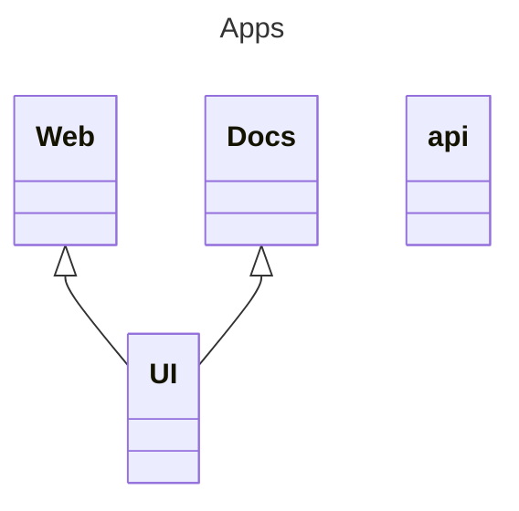
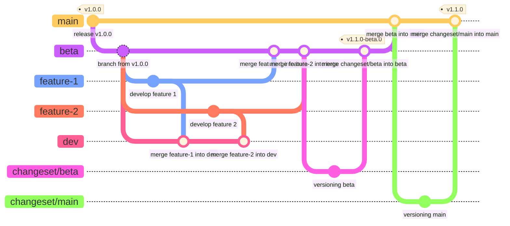
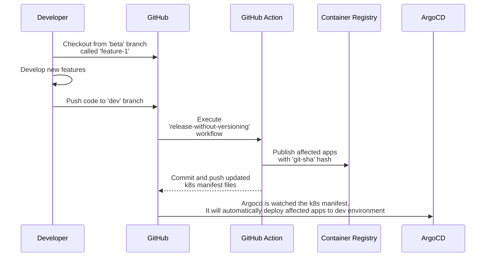
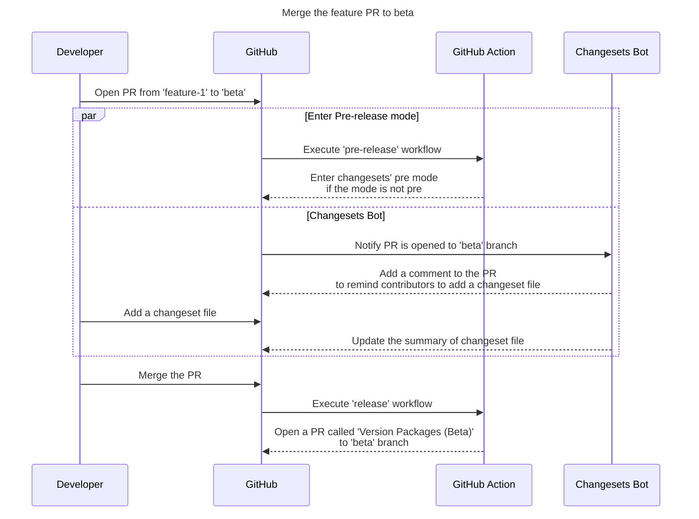
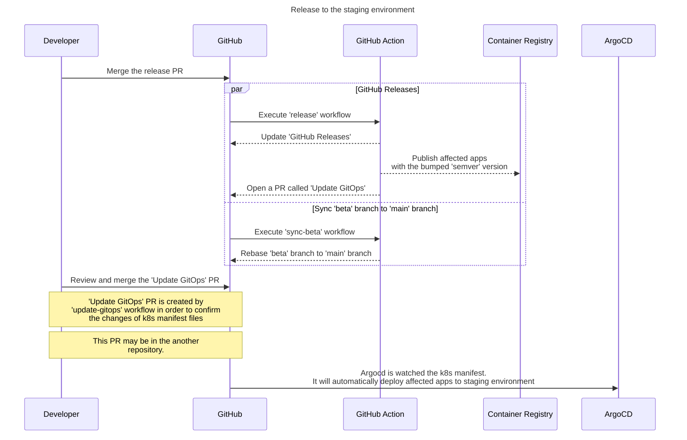
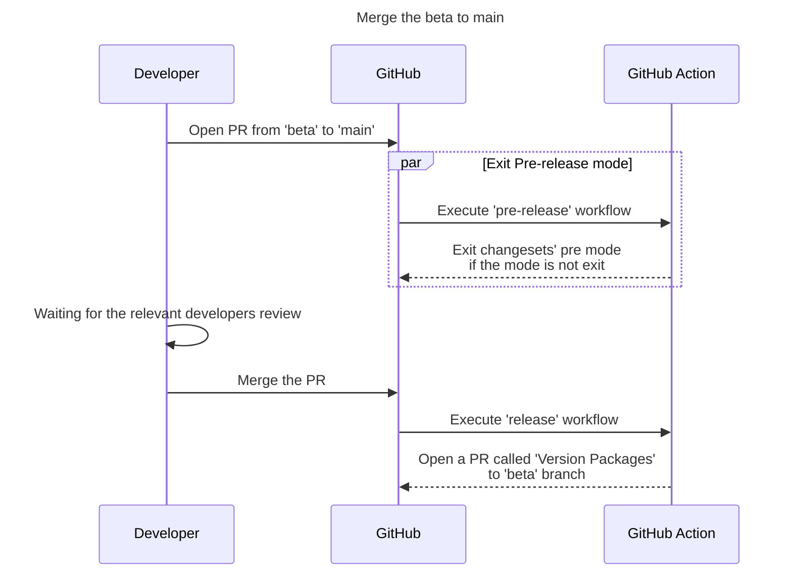

# Monorepo Versioning with GitOps <!-- omit in toc -->

As [Microservices architecture][1] becomes popular recently, [Monorepo][2] is also in trend right now as a software development concept. If you don't know what a Monorepo is, I recommend you to read [Why you should use Monorepo and why you should not][3] first.

One of the biggest challenges of a Monorepo is how to optimize the deployment pipeline and versioning for your apps and packages. In this demonstration, I'll show you how.

# Table of Contents <!-- omit in toc -->

- [Real use cases](#real-use-cases)
- [Tools I used](#tools-i-used)
- [Why versioning is important](#why-versioning-is-important)
- [What is ArgoCD](#what-is-argocd)
- [Demo Architecture](#demo-architecture)
- [Deployment and Versioning Demo](#deployment-and-versioning-demo)
  - [Dev Deployment](#dev-deployment)
  - [Staging (Beta) Deployment](#staging-beta-deployment)
  - [Production Deployment](#production-deployment)
- [Sequence Diagram](#sequence-diagram)
  - [Scenario 1: Develop new features and deploy to dev environment](#scenario-1-develop-new-features-and-deploy-to-dev-environment)
  - [Scenario 2: Deploy the new feature to staging environment](#scenario-2-deploy-the-new-feature-to-staging-environment)
  - [Scenario 3: Deploy the new feature to production environment](#scenario-3-deploy-the-new-feature-to-production-environment)
- [How can I setup the CI/CD pipeline for my monorepo?](#how-can-i-setup-the-cicd-pipeline-for-my-monorepo)
  - [Setup Changesets](#setup-changesets)
  - [Setup ArgoCD to your cluster](#setup-argocd-to-your-cluster)
    - [Quick start](#quick-start)
- [Q \& A](#q--a)
- [Reference](#reference)

# Real use cases

- [CU Get Reg](https://github.com/thinc-org/cugetreg)

# Tools I used

- Monorepo management tool - [Turborepo][4]
- Versioning tool - [Changesets][5] and [Changesets Action][6]
- CI/CD tool - [GitHub Actions][7]
- GitOps tool - [ArgoCD][8]

# Why versioning is important

Versioning is important because it helps you track changes in your apps and packages from the CHANGELOG. It also enables you to understand what's new in the latest version of your apps and packages, and it indicates the type of changes made (such as feature, bug fix, breaking change, etc.).

To learn more about versioning, visit: https://en.wikipedia.org/wiki/Software_versioning.

# What is ArgoCD

[ArgoCD][8] is a [GitOps](https://about.gitlab.com/topics/gitops/) tool that helps you manage your apps and packages in K8s using a declarative approach. You can learn more about ArgoCD at [https://argoproj.github.io/argo-cd/][8].

ArgoCD follows the pull model, which means that it pulls the image with a specific version defined in the K8s manifest file.

In contrast, traditional CI/CD pipelines follow the push model. This means that you must apply the K8s manifest file to the cluster after the CI/CD pipeline is finished. Additionally, you may need to set up credentials for the CI/CD pipeline to access the cluster, which can lead to security issues.

To learn more about GitOps and the differences between the push model and the pull model, here [https://faun.pub/gitops-comparison-pull-and-push-88fcbaadfe45][9].

# Demo Architecture

Here is the application architecture for this repository. It consists of three applications and one shared package. The shared package contains code that is common across the applications except api, while each of the three applications has its own unique functionality. The architecture is designed to be simple and easy to understand, making it a great starting point for developers who are new to the repository.



# Deployment and Versioning Demo

Versionning and deployment workflow is based on [GitFlow][9], which is a branching model for Git.

Assume that you have 3 application's environments.

1. **Production** - This environment is for end-users and is located in the `main` branch.
2. **Staging (Beta)** - This environment is for testing new features and bug fixes before releasing them to production. It's located in the `beta` branch.
3. **Development** - This environment allows developers to test their code by deploying it for testing purposes without reviewing before opening PRs to `beta`. It's located in the `dev` branch.



## Dev Deployment

1. When you and your team want to develop new features or bug fixes, you may need to create a new branch from the `beta` branch. This new branch is called a `feature` branch.
2. After you finish your code changes, you can merge the `feature` branch into the `dev` branch without opening a PR. GitHub Actions will automatically deploy your changes to the `dev` environment, allowing you to test your code without versioning.

## Staging (Beta) Deployment

1. If the `dev` environment is working correctly, you can open a PR from the `feature` branch to the `beta` branch. This will let reviewers know what's new in this PR.
2. Don't forget to add a changeset file to describe the changes in your apps and packages. You can read more about [adding changeset](https://github.com/changesets/changesets/blob/main/docs/adding-a-changeset.md) here.

   
   

3. After the PR is approved and merged (using any merge strategy e.g. merge commit, squash commit), GitHub Actions will automatically create a new PR called **Version Packages (Beta)** that targets the `beta` branch. This PR will summarize the changes made to your apps and packages in this release, as illustrated below:

   

4. After the PR is merged, GitHub Actions will automatically publish your affected apps to the Container Registry, which in this case is GitHub Container Registry. Additionally, GitHub Actions will automatically create a GitOps PR called **Update GitOps** to bump the version of the image in K8s manifests, as illustrated below:

   
   

   > This step take advantage of [GitOps][10] to manage K8s manifests.

   > This step can take a significant amount of time to complete, as it involves building Docker images for your affected apps and pushing them to the Container Registry.

## Production Deployment

1. If you want to officially release your apps and packages to the production environment, you can open a PR from the `beta` branch to the `main` branch. At this step, you should ask the contributors if their changes work in the staging environment.
2. After the PR is approved and merged (with any merge strategy), like staging deployment, GitHub Actions will open a PR called **Version Packages** to `main` branch. This PR will summarize the changes of your apps and packages in this release, like this.

   

3. After the PR is merged, your affected apps will be published to the Container Registry with the bumped version, similar to the staging deployment. Additionally, an **Update GitOps** PR will also be opened to bump the version of the image in the K8s manifests.

   

4. Merge the **Update GitOps** PR to the `main` branch. This will automatically deploy your apps to the production environment.

   

> Note: Every time the K8s manifests are updated, ArgoCD will automatically deploy your apps to the affected environment.

# Sequence Diagram

The flow of development extended from [GitFlow][9] and the versioning workflow comes from [Changesets Release Action][6]. The following diagram shows the flow of development and versioning, as I explained above.

## Scenario 1: Develop new features and deploy to dev environment



> After this step, you, who implemented the new features, should test your apps in the dev environment. If everything works properly, you can move to the next step.

## Scenario 2: Deploy the new feature to staging environment



> The **Version Packages (Beta)** is a PR created by [Changesets Release Action][6] in order to summarize the changes of your apps and packages in this pre-release.



> After this step, you might see the new feature in the staging environment.

## Scenario 3: Deploy the new feature to production environment

Assuming that the new features on the staging environment work properly, you may want to officially release your apps and packages to the production environment.

This step is simpler than the pre-release step.




> As a developer, you don't have to perform any manual deployment tasks to release the new feature to a specific environment. All you have to do is merge the relevant PRs.

# How can I setup the CI/CD pipeline for my monorepo?

There are things you need to do if you already have your monorepo workspace set up, but for the most part, all you need to do is:

1. Setup Changeset configuration
2. Setup ArgoCD for your k8s cluster
3. Copy/paste all workflows under [.github/workflow](./.github/workflows/) from this repository. (Make sure you understand what it's doing)
4. Setup the secrets, `GH_TOKEN` ([GitHub PAT](https://docs.github.com/en/authentication/keeping-your-account-and-data-secure/creating-a-personal-access-token) with `repo` permission to let Action open the 'Update GitOps' PR)

## Setup Changesets

1. Install Changesets CLI in the root of the workspace:

   ```bash
   pnpm add -D -W @changesets/cli
   ```

2. Initialize Changesets:

   ```bash
   pnpm changeset init
   ```

   At this point, two files will be created:

   ```
   .changeset/config.json
   .changeset/README.md
   ```

3. Configure the `config.json` file:

   ```diff
   {
     "$schema": "https://unpkg.com/@changesets/config@2.3.0/schema.json",
   - "changelog": "@changesets/cli/changelog",
   + "changelog": ["@changesets/changelog-github", { "repo": "ORGANIZATION_NAME/REPO_NAME" }],
     "commit": false,
     "fixed": [],
     "linked": [],
     "access": "restricted",
     "baseBranch": "main",
     "updateInternalDependencies": "patch",
     "ignore": []
   }
   ```

   - `changelog` - This specifies the changelog generator used to generate the changelog for each package. In this case, we use the [GitHub changelog](https://github.com/changesets/changesets/tree/main/packages/changelog-github) generator.

   > Be sure to replace `ORGANIZATION_NAME` and `REPO_NAME` with your own GitHub organization and repository name.

4. Add [Changesets bot](https://github.com/apps/changeset-bot) for your repository.
5. Set up the GitHub Action workflow for releasing apps and packages. You can copy [my action YAML](./.github/workflows/release.yaml) here.
6. For the apps that you want to build as Docker images, you need to add a `Dockerfile` to each of them. You can copy my Docker file here

   - NextJS app - [Dockerfile](./apps/web/Dockerfile)
   - NestJS app - [Dockerfile](./apps/api/Dockerfile)

   > Note the workflow will skip to build Docker images if there is no `Dockerfile` in the app. But it will still bump the version of the app.

7. You're done! Now you're ready to use Changesets to release your apps and packages.

## Setup ArgoCD to your cluster

Please following the [official documentation](https://argo-cd.readthedocs.io/en/stable/getting_started/) to setup ArgoCD for your k8s cluster.

Or, follow the casual version of setup ArgoCD here

1. [Setup ArgoCD Part 1][11]
2. [Setup ArgoCD Part 2][12]
3. [Setup ArgoCD Part 3][13]

### Quick start

After you [install ArgoCD](https://argo-cd.readthedocs.io/en/stable/getting_started/), you may need to create a app, project, and repository credentials. Please run

```bash
kubectl apply -f ./k8s/argo
```

It'll create apps for every environment that defined in [apps](./k8s/apps).

Finally, run the follwing command to port-forward the ArgoCD dashboard.

```bash
kubectl port-forward svc/argocd-server -n argocd 8080:443
```

The dashboard will be available at [https://localhost:8080](https://localhost:8080)

# Q & A

1. What if I forgot to create a changeset file for my PR?

   **Answer**:

   You can create a changeset file for your change manually by running

   ```bash
   pnpm changeset
   ```

   Then, you can commit the changeset file and push it to the remote branch.

2. What if I misspell the changeset file content?

   **Answer**:

   You can fix the changeset file's content any time you want before you merge the release PR. Make sure to review the changeset file every time.

3. What if I want to 2-step pre-release e.g. `alpha` for the first pre-release and `beta` for the second pre-release?

   **Answer**:

   It's not possible for now. Since the Changeset does not support it right now.

# Reference

Many thanks to the authors and contributors of the following articles and projects, which provided valuable insights and inspiration for this article.

- [What are Microservices][1]
- [Monorepo.tools][2]
- [Why you should use monorepo and why you shouldn't][3]
- [Turborepo][4]
- [Changesets][5]
- [Changesets Action][6]
- [GitHub Actions][7]
- [ArgoCD][8]
- [The GitOps Comparison: Pull and Push][9]
- [GitOps Concept][10]
- [Setup ArgoCD Part 1][11]
- [Setup ArgoCD Part 2][12]
- [Setup ArgoCD Part 3][13]

[1]: https://microservices.io/ 'What are Microservices'
[2]: https://monorepo.tools/ 'Monorepo.tools'
[3]: https://lembergsolutions.com/blog/why-you-should-use-monorepo-and-why-you-shouldnt "Why you should use monorepo and why you shouldn't"
[4]: https://turbo.build/ 'Turborepo'
[5]: https://github.com/changesets/changesets 'Changesets'
[6]: https://github.com/changesets/action 'Changesets Action'
[7]: https://github.com/features/actions 'GitHub Actions'
[8]: https://argo-cd.readthedocs.io/en/stable/ 'ArgoCD'
[9]: https://faun.pub/gitops-comparison-pull-and-push-88fcbaadfe45 'The GitOps Comparison: Pull and Push'
[9]: https://nvie.com/posts/a-successful-git-branching-model/ 'Git Flow'
[10]: https://www.weave.works/technologies/gitops/ 'GitOps Concept'
[11]: https://medium.com/thinc-org/%E0%B8%A1%E0%B8%B2%E0%B8%A5%E0%B8%AD%E0%B8%87-setup-gitops-%E0%B8%94%E0%B9%89%E0%B8%A7%E0%B8%A2-argocd-kustomize-%E0%B8%81%E0%B8%B1%E0%B8%99%E0%B9%80%E0%B8%96%E0%B8%AD%E0%B8%B0-part-1-8db644ccbd49 'Setup Argp CD Part 1'
[12]: https://medium.com/thinc-org/%E0%B8%A1%E0%B8%B2%E0%B8%A5%E0%B8%AD%E0%B8%87-setup-gitops-%E0%B8%94%E0%B9%89%E0%B8%A7%E0%B8%A2-argocd-kustomize-%E0%B8%81%E0%B8%B1%E0%B8%99%E0%B9%80%E0%B8%96%E0%B8%AD%E0%B8%B0-part-2-e8016ec4cb07 'Setup Argp CD Part 2'
[13]: https://medium.com/thinc-org/%E0%B8%A1%E0%B8%B2%E0%B8%A5%E0%B8%AD%E0%B8%87-setup-gitops-%E0%B8%94%E0%B9%89%E0%B8%A7%E0%B8%A2-argocd-kustomize-%E0%B8%81%E0%B8%B1%E0%B8%99%E0%B9%80%E0%B8%96%E0%B8%AD%E0%B8%B0-part-3-42c4fc714078 'Setup Argp CD Part 3'
